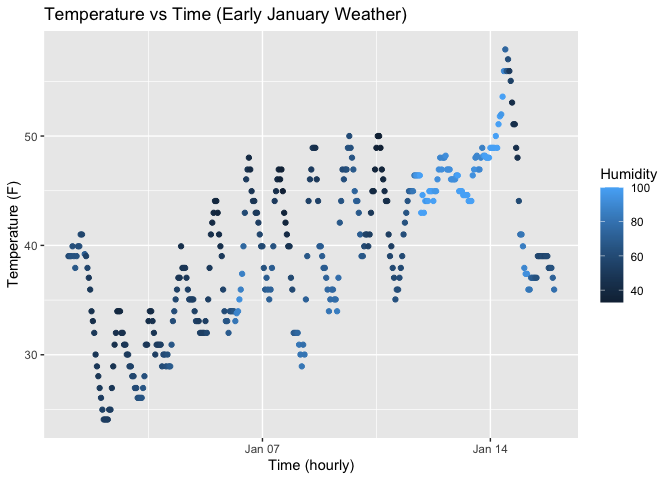

p8105_hw1_ml5218
================
Muying Li
2025-09-18

# Problem 1

Load packages

``` r
library(moderndive)
library(tidyverse)
```

    ## ── Attaching core tidyverse packages ──────────────────────── tidyverse 2.0.0 ──
    ## ✔ dplyr     1.1.4     ✔ readr     2.1.5
    ## ✔ forcats   1.0.0     ✔ stringr   1.5.1
    ## ✔ ggplot2   3.5.2     ✔ tibble    3.3.0
    ## ✔ lubridate 1.9.4     ✔ tidyr     1.3.1
    ## ✔ purrr     1.1.0     
    ## ── Conflicts ────────────────────────────────────────── tidyverse_conflicts() ──
    ## ✖ dplyr::filter() masks stats::filter()
    ## ✖ dplyr::lag()    masks stats::lag()
    ## ℹ Use the conflicted package (<http://conflicted.r-lib.org/>) to force all conflicts to become errors

Load the `early_january_weather` dataset & access its help file

``` r
data("early_january_weather") 
help("early_january_weather")
```

Skim through the dataset to get data summary (size), variable names, and
mean temperature:

``` r
skimr::skim(early_january_weather)
```

## Short description of `early_january_weather`

The dataset `early_january_weather` contains “hourly meteorological data
for LGA, JFK and EWR for the month of January 2013. This is a subset of
the weather data frame from nycflights13.” (from help file).

This dataset has 358 rows and 15 columns. It contains the following
variables: origin, year, month, day, hour, temp, dewp, humid, wind_dir,
wind_speed, wind_gust, precip, pressure, visib, time_hour.

The mean temperature is 39.5821229.

## Visualization of `early_january_weather` (Scatterplot)

``` r
# define dataframe containing temp (y) vs time_hour (x)
plot_df = tibble(
  x = early_january_weather$time_hour,
  y = early_january_weather$temp,
  color = early_january_weather$humid
)
# scatterplot of x and y
p <- ggplot(plot_df, aes(x = x, y = y, color = color)) + 
  geom_point() +
  labs(
    title = "Temperature vs Time (Early January Weather)",
    x = "Time (hourly)",
    y = "Temperature (F)",
    color = "Humidity"
  )
p
```

<!-- -->

``` r
# save the scatterplot
ggsave("scatter_temp_time.png", plot = p)
```

    ## Saving 7 x 5 in image

From the plot, we can see that:

1.  Temperature gradually increased from the beginning of January toward
    mid-January, with daily fluctuation cycles (usually colder at night
    and warmer during daytime). However, there was a sudden drop on the
    temperature of Jan 15. Daily temperature differences were smallest
    around Jan 12-13.

2.  As the color represents humidity, lighter color means higher
    humidity and darker color indicates lower humidity. Around Jan
    12-13, with small differences in daily highest and lowest
    temperatures, the humidity levels were high. In the beginning of
    January, the weather were colder and less humid.

# Problem 2

## Create a data frame

- *a random sample of size 10 from a standard Normal distribution*
- *a logical vector indicating whether elements of the sample are
  greater than 0*
- *a character vector of length 10*
- *a factor vector of length 10, with 3 different factor “levels”*

``` r
set.seed(123) 

df <- tibble(
  random_norm = rnorm(10), # numeric 
  greater_than0 = random_norm > 0, # logical
  char_vec = letters[1:10], # char
  factor_vec = factor(rep(c("A", "B", "C"), length.out = 10))  # factor
)
df
```

    ## # A tibble: 10 × 4
    ##    random_norm greater_than0 char_vec factor_vec
    ##          <dbl> <lgl>         <chr>    <fct>     
    ##  1     -0.560  FALSE         a        A         
    ##  2     -0.230  FALSE         b        B         
    ##  3      1.56   TRUE          c        C         
    ##  4      0.0705 TRUE          d        A         
    ##  5      0.129  TRUE          e        B         
    ##  6      1.72   TRUE          f        C         
    ##  7      0.461  TRUE          g        A         
    ##  8     -1.27   FALSE         h        B         
    ##  9     -0.687  FALSE         i        C         
    ## 10     -0.446  FALSE         j        A

## Try to take the mean of each variable in the `df`

``` r
mean(df %>% pull(random_norm))
```

    ## [1] 0.07462564

``` r
mean(df %>% pull(greater_than0))
```

    ## [1] 0.5

``` r
mean(df %>% pull(char_vec))
```

    ## Warning in mean.default(df %>% pull(char_vec)): argument is not numeric or
    ## logical: returning NA

    ## [1] NA

``` r
mean(df %>% pull(factor_vec))
```

    ## Warning in mean.default(df %>% pull(factor_vec)): argument is not numeric or
    ## logical: returning NA

    ## [1] NA

Only the numeric and logical vectors work, while the character and
factor vectors fail.

## Explicitly convert variables from one type to another

*Apply the `as.numeric` function to the logical, character, and factor
variables*

``` r
as.numeric(df %>% pull(greater_than0))
as.numeric(df %>% pull(char_vec))
as.numeric(df %>% pull(factor_vec))
```

1.  Both logical and factor vectors can be converted to numeric.

    1.  In logical vector, `TRUE` becomes `1` and `FALSE` becomes `0`.
        This explains that taking the mean of a logical vector gives the
        proportion of `TRUE`.  
    2.  In factor vector, `A` becomes `1`, `B` becomes `2`, and `C`
        becomes `3`. `as.numeric` function now coerces the factor vector
        to integer codes not the label (`A`,`B`,`C`). So now the
        `mean(as.numeric(df$factor_vec))` will work.

2.  The character vector cannot be coerced to numeric values with the
    wraning: “NAs introduced by coercion”. Hence, taking the mean over
    character vector throw an error.
